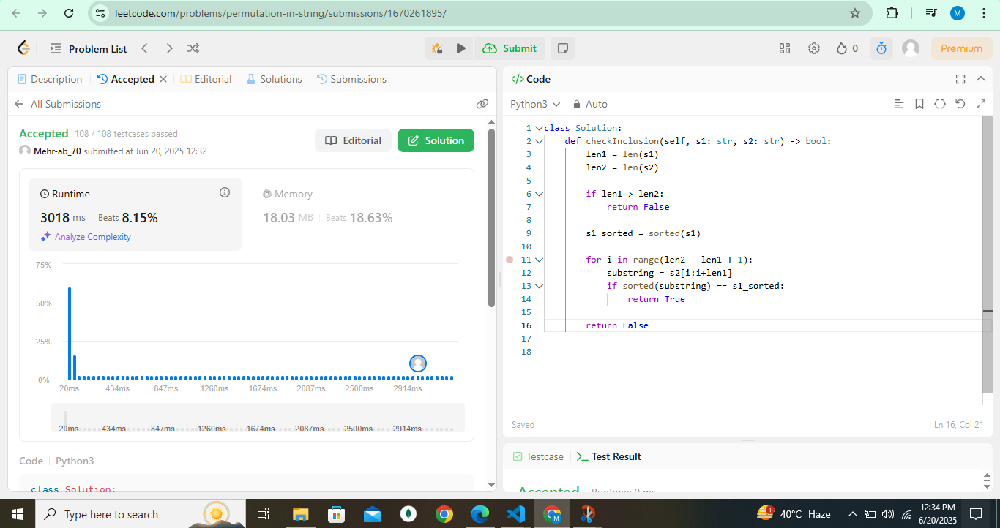
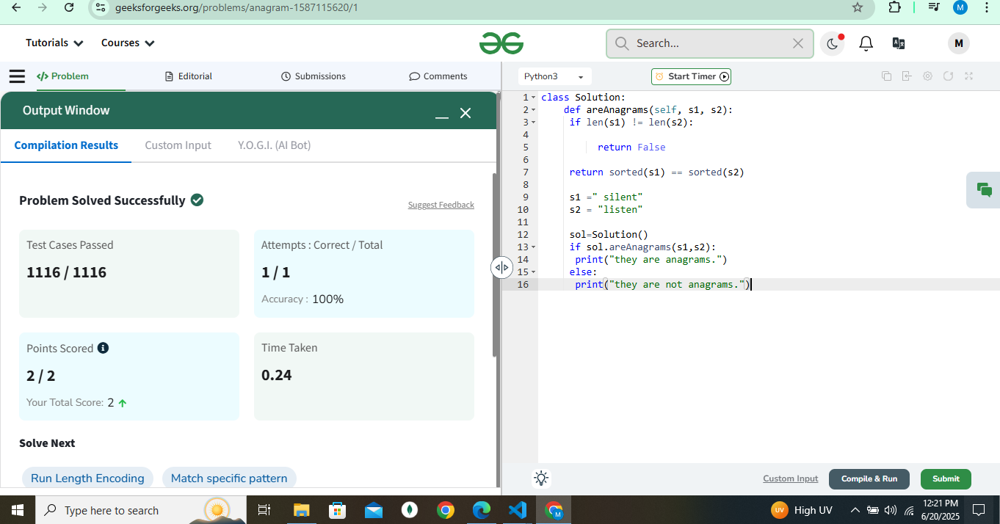

# Check Permutation – By Mehrab Siddique

# Problem 1.2 - Check Permutation

## 📘 Problem Details

Problem Number: 1.2Problem Name: Check PermutationDescription: Given two strings, write a method to decide if one is a permutation of the other.GeeksforGeeks Link: Check if Two Strings are PermutationLeetCode Link: Permutation in String

## 🛠️ Implementation Details

The PermutationCheckerByMehrab class implements a single method to check if one string is a permutation of another using Sorting.

### 1. Sorting Approach

public boolean isPermutationBySorting(String s1, String s2)

Time Complexity: O(n log n) due to sorting

Space Complexity: O(n) for creating char arrays

Description:
Sorts both input strings and compares them for equality. If the sorted strings are identical, they are permutations of each other.

## ✅ Advantage: Simple and intuitive.

⚠️ Limitation: Higher time complexity due to sorting; not optimal for very large strings.

💻 Python Code
``` Python
class Solution:
    def areAnagrams(self, s1, s2):
        if len(s1) != len(s2):
            return False
        return sorted(s1) == sorted(s2)

# Example Usage
s1 = "silent"
s2 = "listen"
sol = Solution()

if sol.areAnagrams(s1, s2):
    print("They are anagrams.")
else:
    print("They are not anagrams.")

🧪 Sample Input/Output

Example 1:

Input: s1 = "abc", s2 = "cab"
Output: True

Example 2:

Input: s1 = "aabb", s2 = "bbaa"
Output: True

Example 3:

Input: s1 = "abcd", s2 = "dcbae"
Output: False
```

## ⏱️ Time & Space Complexity

Metric

Value

Time Complexity

O(n log n)

Space Complexity

O(n)

## 📝 Notes

You can improve performance using a frequency-count approach (O(n) time).

Sorting approach is good for clarity and correctness.

📷 Submission Screenshot





## ✍️ Author

Mehrab Siddique